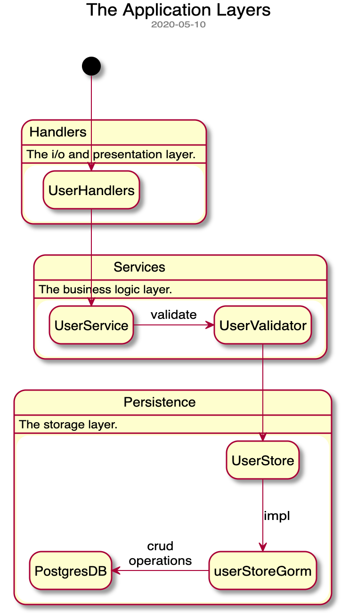

## Goal oriented gallery

This is a playground project to experiment with Golang and two of its popular projects:
- Gorilla - request router
- GORM - an ORM implementation

### Prereqs

PostgreSQL database is being used as the persistence storage.

You can either use your own instance or start a Docker container image using `docker-compose up -d`. The script `run-db.sh` is provided for your convenience.

Manual entry:
`INSERT INTO users (age, email, first_name, last_name) VALUES (30, 'joe@email.com', 'Joe', 'Black');`

### Run in dev mode

To "reload" the application when changes are detected, [air](https://github.com/cosmtrek/air) tool is used. The config file is included in the project as `.air.conf` file.

To install the tool you can run `go get -u github.com/cosmtrek/air` being outside of this repo, as it's not a dependency to this module, and you don't want to accidentally declare it as it actually is.

Then run `air` while being in the project directory. The script `run-dev.sh` is provided for your convenience.

### Design

Here is an overview of the layers:

